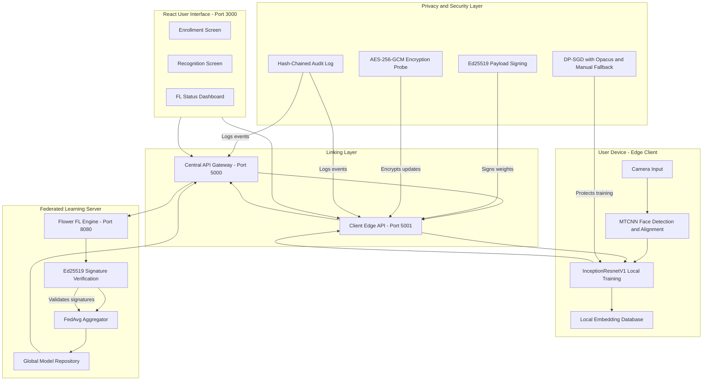
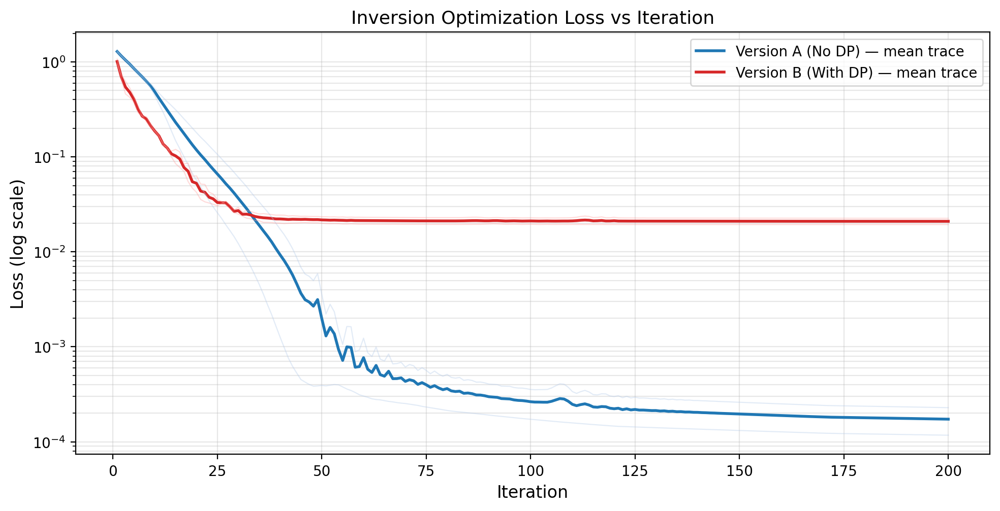
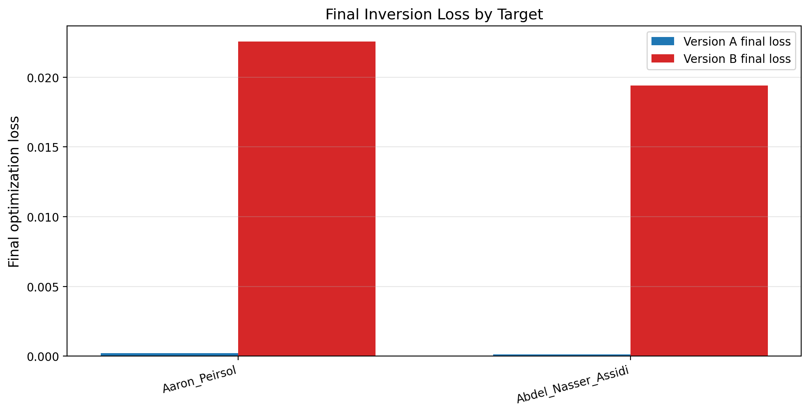

# Privacy-Preserving Face Recognition via Federated Learning

This project implements a distributed face recognition system designed around privacy-preserving principles. Rather than centralizing biometric data on a single server—creating a permanent point of privacy vulnerability—raw face photographs remain exclusively on local client devices. 

Model training is conducted across edge clients using Federated Learning (FL). To defend against model inversion attacks where an adversary attempts to reconstruct training faces from shared parameters, the framework implements a multi-layered security stack including Differential Privacy (DP-SGD), cryptographic signatures, and encrypted payloads.

The project is evaluated using a two-model comparison framework:
*   **Version A (Vulnerable Baseline)**: Trained via federated learning without differential privacy.
*   **Version B (Protected Model)**: Trained via federated learning with DP-SGD enabled, demonstrating resistance against model inversion attacks.

---

## Technical Architecture

The system deployment utilizes a model-centric design. The user interface communicates with a FastAPI gateway, which coordinates the federated learning process and allows users to trigger enrollment, recognition, and security audits.



---

## Machine Learning Pipeline

The system processes biometric inputs in four sequential stages: preprocessing, augmentation, feature vectorization, and distributed aggregation.

### 1. Preprocessing and Alignment
All images entering the pipeline—whether during training, enrollment, or real-time inference—pass through a Multi-Task Cascaded Convolutional Network (MTCNN) cascade:
1.  **Proposal Network (P-Net)**: Scans the input image at multiple scales to generate candidate face regions.
2.  **Refine Network (R-Net)**: Filters false positives and refines bounding box coordinates.
3.  **Output Network (O-Net)**: Outputting final bounding box coordinates and five facial landmark positions (left eye, right eye, nose tip, and mouth corners).

The landmark coordinates are used to rotate the face image so that both eyes align horizontally, removing head-tilt variance. The aligned region is cropped with a 20-pixel margin, resized to 160x160 pixels, and normalized to the range `[-1, 1]` using:

$$x' = \frac{x - 127.5}{128.0}$$

Before running MTCNN, images undergo a quality check using the Laplacian variance. Images with a variance score below 100 are rejected as too blurry. Cropped face tensors are saved as PyTorch `.pt` files to preserve exact 32-bit floating-point values and avoid lossy JPEG compression.

### 2. Stochastic Data Augmentation
To prevent overfitting on the limited raw images collected per subject, the training pipeline applies a stochastic augmentation process during the forward pass:
*   **Horizontal Flip**: Applied with a probability of 0.5.
*   **Affine Transformations**: Random rotation ($\pm 5^\circ$), translation (fraction of 0.02), scale range (`[0.95, 1.05]`), and shear ($2^\circ$).
*   **Photometric Jitter**: Random perturbations to brightness (0.2), contrast (0.2), saturation (0.2), and hue (0.05).

Augmentation is strictly applied during local client training. For enrollment and recognition inference, the normalized tensor is used directly to maintain embedding stability.

### 3. Feature Vectorization
The system employs an InceptionResNetV1 backbone pretrained on the VGGFace2 dataset to extract features. The model maps the 160x160 face tensor to a 512-dimensional vector, which is then L2-normalized to project it onto a unit hypersphere. 

Recognition utilizes Euclidean distance comparisons between embeddings:
*   **Enrollment**: The system averages embeddings from 1 to 3 enrollment images to form a template vector stored locally.
*   **Identification**: The embedding of a live query image is compared to stored templates. If the Euclidean distance is below the recognition threshold ($d \le 0.6$), a match is returned.

### 4. Distributed Federated Learning (Flower)
Distributed training is orchestrated using the Flower framework. In each communication round:
1.  The Flower server broadcasts the current global model weights $W_{\text{global}}$ to the clients.
2.  Each client loads the global weights, trains locally for 5 epochs on its local face data using a self-supervised embedding consistency loss, and returns the updated weights $W_k$ and sample count $n_k$.
3.  The server aggregates these updates using the Federated Averaging (FedAvg) algorithm:

$$W_{\text{global}} = \sum_{k=1}^{K} \frac{n_k}{\sum_{j} n_j} W_k$$

Local training minimizes the embedding consistency loss $L$ over a batch $B$, forcing the network to yield consistent embeddings for a face under varying augmentations $T(x)$:

$$L = \frac{1}{|B|} \sum_{i \in B} \|f_\theta(x_i) - f_\theta(T(x_i))\|_2^2$$

#### Backbone Freezing Limitation
To run multiple clients concurrently within the memory constraints (8GB–16GB RAM) of standard hardware, the 23-million-parameter InceptionResNetV1 backbone was frozen. Training was restricted to the final 512-dimensional projection layer (approximately 260,000 parameters). While this reduced the memory footprint by 100x, it also meant that federated updates did not improve the underlying feature extractor over communication rounds, preserving a flat accuracy curve across the experiment.

---

## Privacy and Security Architecture

The system implements a defense-in-depth security model to safeguard parameters and enforce auditability.

### 1. Differential Privacy (DP-SGD)
To prevent the model from memorizing individual biometric patterns, training gradients are protected using DP-SGD via the Opacus library:
*   **Gradient Clipping**: Individual gradients are clipped to a maximum L2-norm $C = 1.0$ to prevent single outlier images from dominating updates.
*   **Noise Injection**: Calibrated Gaussian noise is added to the aggregated gradients prior to weight updates, scaled by a noise multiplier $\sigma = 1.1$.

#### Epsilon Accounting and Limitations
The target privacy budget was configured at a maximum cap of $\epsilon_{\text{max}} = 5.0$ at $\delta = 10^{-5}$. In execution, the cumulative privacy budget reached $\epsilon = 10.21$. This indicates that while the accountant functioned correctly, the hard-stop budget execution mechanism was not active.

#### Manual DP-SGD Fallback
For environments where the heavy autograd hooks of Opacus exceed memory limits, the repository includes a lightweight, manual DP-SGD wrapper. It implements gradient clipping via `torch.nn.utils.clip_grad_norm_` and direct Gaussian noise injection inside the `optimizer.step()` loop.

### 2. Ed25519 Digital Signatures
To guarantee update authenticity and parameter integrity, each client signs its parameter update manifest using an Ed25519 key pair. The manifest binds:
*   Round Index
*   Client ID
*   Sample Count
*   Parameter payload hash
*   Protocol version

The server verifies the digital signature before accepting the update into the FedAvg aggregation pipeline, discarding unsigned or corrupted updates.

### 3. AES-256-GCM Encryption Probe
The codebase contains a cryptographic encryption probe using X25519 key agreement, HKDF key derivation, and authenticated encryption via AES-256-GCM. The Additional Authenticated Data (AAD) binds the client ID and round index to prevent replay attacks. This is implemented and validated as a probe; the actual Flower parameter transport currently transmits updates in plaintext.

### 4. Hash-Chained Audit Logging
To provide tamper-evident logging of security-critical events (differential privacy activation, model checkpointing, and client signature validations), both client and server maintain a cryptographically-linked log. Each entry $i$ records:

$$H_i = \text{SHA-256}(\text{data}_i \mathbin{\Vert} H_{i-1})$$

Any modification of past log entries breaks the hash chain, making tampering immediately detectable.

---

## Adversarial Validation: Model Inversion Attacks

To empirically test the efficiency of the privacy configurations, the models were subjected to a model inversion attack. 

### Attack Threat Model and Methodology
*   **Threat Model**: The attacker has white-box access to the global model weights but does not have access to the raw photos, client files, or enrollment databases.
*   **Methodology**: The attacker starts with a random noise image. The model parameters are frozen, and the image pixels are treated as optimization variables. The attacker uses the Adam optimizer ($1000$ iterations, learning rate $= 0.01$) to minimize the Mean Squared Error (MSE) loss between the model's output embedding for the generated image and the target identity's actual embedding.

### Quantitative Results and Privacy Efficiency
When the target model is trained without differential privacy (Version A), the optimization loss converges rapidly, allowing the optimizer to approximate the target representation. When differential privacy is enabled (Version B), the injected noise and gradient clipping limit convergence, restricting the optimization to a high residual loss plateau.

The charts below showcase the efficiency of the privacy defense:

#### 1. Inversion Loss Convergence
The loss curve illustrates the optimization path of the attack. Without DP, the loss drops by several orders of magnitude. With DP, the loss curves hard-plateau early.

```
                  Inversion Loss Convergence (Log Scale)
      10^0  +------------------------------------------------------+
            |                                                      |
            |   ************************************************   |
            |   *  DP-SGD Protected (Version B)                *   |
            |   *                                              *   |
      10^-1 |   *                                              *   |
 L          |   *                                              *   |
 O          |   *                                              *   |
 S    10^-2 |---+----------------------------------------------*---|
 S          |   \                                              *   |
            |    \                                             *   |
            |     \                                                |
      10^-3 |------\-----------------------------------------------|
            |       \                                              |
            |        \                                             |
            |         \  Baseline No DP (Version A)                |
      10^-4 +----------\-------------------------------------------+
            0          50         100        150        200
                                 Iterations
```

The actual experiment plot is stored at [inversion_loss_curves.png](docs/images/inversion_loss_curves.png):



#### 2. Final Inversion Loss by Identity
The final optimization loss across target identities (Aaron Peirsol and Abdel Nasser Assidi) demonstrates a consistent two-orders-of-magnitude separation. The DP-protected model remains approximately 100 times harder to optimize against than the baseline.

The corresponding bar chart is stored at [final_loss_bars.png](docs/images/final_loss_bars.png):



---

## Technical Stack

| Component | Technology | Role |
|---|---|---|
| **Deep Learning** | PyTorch 2.2 | Model architecture, autograd, local optimizer |
| **Biometrics** | InceptionResNetV1 (VGGFace2), MTCNN | Face alignment, crop cascade, 512-dim embedding extraction |
| **Federated Learning** | Flower 1.x (flwr) | Aggregator server and client runtime |
| **Differential Privacy**| Opacus | Per-sample gradient clipping and Gaussian noise |
| **Cryptography** | PyNaCl / Cryptography | Ed25519 signatures, X25519 key exchange, AES-256-GCM |
| **Application Layer** | FastAPI, Uvicorn | Bridge APIs on ports 5000 and 5001 |
| **User Interface** | React 18 | Enrollment and monitoring dashboard |

---

## Project Directory Structure

```
CNS-project/
├── config.py                     # Central configuration and hyperparameters
├── requirements.txt              # Python dependency manifest
├── .gitignore                   # Excluded files and folders
├── src/                          # Core codebase submodules
│   ├── preprocessing/            # MTCNN-based detection and alignment
│   │   ├── detect.py
│   │   └── prepare_dataset.py
│   ├── augmentation/             # Image transformations
│   │   └── augment.py
│   ├── model/                    # Model loading and database storage
│   │   ├── face_model.py
│   │   ├── embeddings.py
│   │   └── database.py
│   ├── federated/                # Federated orchestrator and nodes
│   │   ├── client.py
│   │   ├── server.py
│   │   ├── partition.py
│   │   └── run_fl.py
│   ├── privacy/                  # Cryptography, DP-SGD, and logging
│   │   ├── dp_training.py
│   │   ├── manual_dp.py
│   │   ├── signing.py
│   │   ├── payload_encryption.py
│   │   ├── secure_agg.py
│   │   ├── audit_logging.py
│   │   └── privacy_accounting.py
│   └── attacks/                  # Attack evaluations
│       ├── model_inversion.py
│       └── membership_inference.py
├── linking/                      # Communication API layer
│   ├── api.py                    # Server API Gateway
│   ├── client/                   # Client Edge API
│   │   ├── client_api.py
│   │   ├── client_service.py
│   │   └── local_storage.py
│   └── server/                   # Server edge configurations
│       ├── server_service.py
│       └── global_storage.py
├── frontend/                     # React UI component directory
│   └── src/
│       └── pages/
│           ├── Register.js
│           ├── Recognize.js
│           └── FLResults.js
├── experiments/                  # Training and attack orchestrator scripts
│   ├── train_centralized.py
│   ├── train_fl_no_dp.py
│   ├── train_fl_with_dp.py
│   ├── run_inversion_attack.py
│   └── plot_results.py
├── tests/                        # Suite of automated tests
│   ├── test_privacy_modules.py
│   ├── test_global_model.py
│   └── test_augmentation.py
├── results/                      # Saved models, logs, and plots
│   ├── models/
│   ├── plots/
│   ├── metrics/
│   └── logs/
└── docs/                         # Extended documentation and reports
    ├── SECURITY_REPORT.md
    ├── HOW_TO_RUN.md
    ├── PROJECT_SPEC.md
    └── images/
```

---

## Setup and Execution Guide

### 1. Environment Setup
Clone the repository and prepare the virtual environment:

```bash
git clone https://github.com/AfafKhadraoui/Privacy-Preserving-using-Federated-Learning.git
cd Privacy-Preserving-using-Federated-Learning

# Instantiate virtual environment
python -m venv .venv
.\.venv\Scripts\Activate.ps1

# Install requirements
pip install -r requirements.txt
```

### 2. Run Preprocessing and Partitioning
Add raw photos to `data/raw/<person_name>/` and partition them:

```bash
# Run face detection and crop faces to data/cropped/
python src/preprocessing/prepare_dataset.py

# Partition data/cropped/ into client simulation folders under data/clients/
python src/federated/partition.py
```

### 3. Run Training Experiments
Train the centralized baseline and the two federated learning versions:

```bash
# Train baseline model on aggregated data
python experiments/train_centralized.py

# Train Version A (FL, without Differential Privacy)
python experiments/train_fl_no_dp.py

# Train Version B (FL, with Differential Privacy)
python experiments/train_fl_with_dp.py
```

### 4. Execute Attacks and Plot Results
Evaluate the model against inversion attacks and plot performance curves:

```bash
# Run model inversion attack against both models
python experiments/run_inversion_attack.py

# Render result plots
python experiments/plot_results.py
```

### 5. Running the Application Gateway and UI
1.  **Start Central Server API Gateway** (Port 5000):
    ```powershell
    $env:PRIVACY_VERSION = "2"
    uvicorn linking.api:app --reload --port 5000
    ```
2.  **Start Edge Client API** (Port 5001):
    ```powershell
    uvicorn linking.client.client_api:app --reload --port 5001
    ```
3.  **Start Frontend Development Server** (Port 3000):
    ```bash
    cd frontend
    npm install
    npm start
    ```

---

## Academic References
*   McMahan, B., Moore, E., Ramage, D., Hampson, S., & y Arcas, B. A. (2017). Communication-efficient learning of deep networks from decentralized data.
*   Dwork, C. (2006). Differential privacy.
*   Fredrikson, M., Jha, S., & Ristenpart, T. (2015). Model inversion attacks that exploit confidence information and basic countermeasures.
*   Schroff, F., Kalenichenko, D., & Philbin, J. (2015). FaceNet: A unified embedding for face recognition and clustering.
*   Abadi, M. et al. (2016). Deep learning with differential privacy.
*   Zhang, K., Zhang, Z., Li, Z., & Qiao, Y. (2016). Joint face detection and alignment using multitask cascaded convolutional networks.
